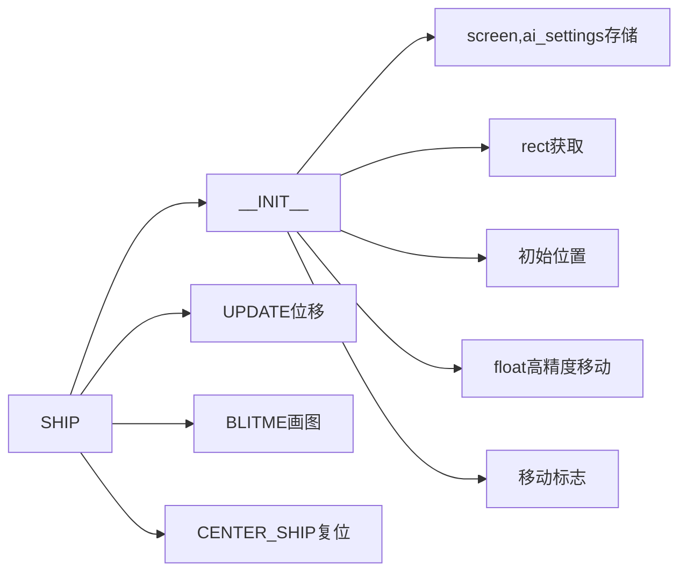

ship.py

```py
import pygame
class Ship():
    def __init__(self,screen,ai_settings):
        #储存以便后续使用
        self.screen=screen
        self.ai_settings=ai_settings
        self.image=pygame.image.load(r'images\ship.bmp')
        #构建rect
        self.rect=self.image.get_rect()
        self.screen_rect=screen.get_rect()
        #初始位置(放中央)
        self.rect.centerx=self.screen_rect.centerx#位置
        self.rect.bottom=self.screen_rect.bottom#位置
        #在飞船的属性center储存，实现高精度  
        self.center=float(self.rect.centerx)
        #移动标志
        self.moving_right=False
        self.moving_left=False
        self.moving_up=False
        self.moving_down=False
        
    def update(self):
        #根据ship_speed_factor调整center
        #注意处理边界问题
        if self.moving_right and self.rect.right<self.screen_rect.right:
            self.center+=self.ai_settings.ship_speed_factor
        if self.moving_left and self.rect.left>0:
            self.center-=self.ai_settings.ship_speed_factor
        if self.moving_up and self.rect.top>0:
            self.rect.top-=self.ai_settings.ship_speed_factor
        if self.moving_down and self.rect.bottom<self.screen_rect.bottom:
            self.rect.bottom+=self.ai_settings.ship_speed_factor
        #根据self.center更新rect对象
        self.rect.centerx=self.center
        
    def blitme(self):
        #画图  
        self.screen.blit(self.image,self.rect)
        
    def center_ship(self):
        '''放中央'''
        self.rect.centerx=self.screen_rect.centerx#位置
        self.rect.bottom=self.screen_rect.bottom#位置
        
```



